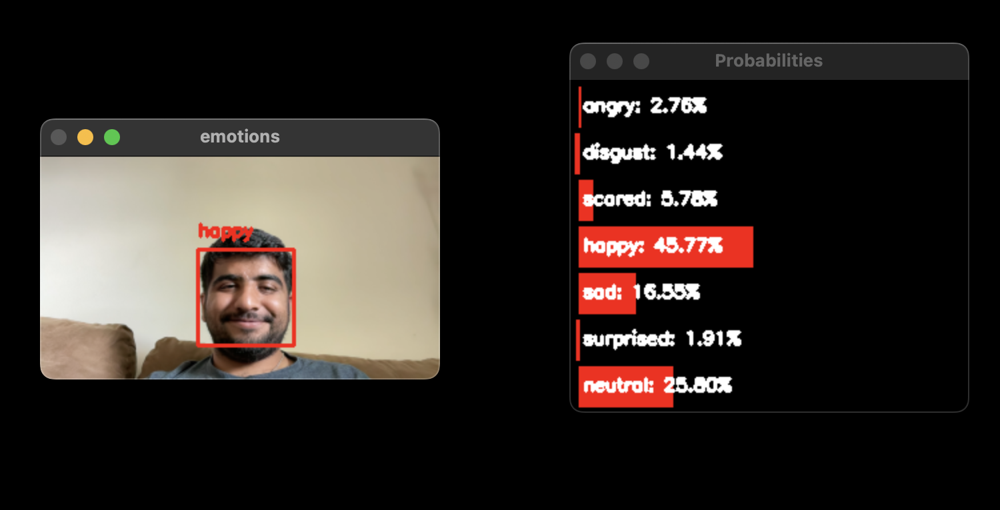
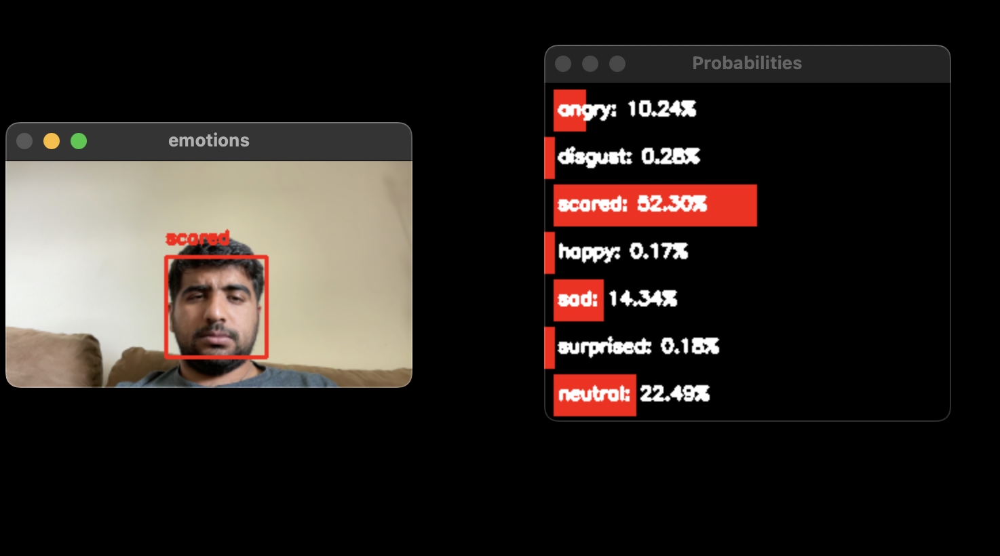
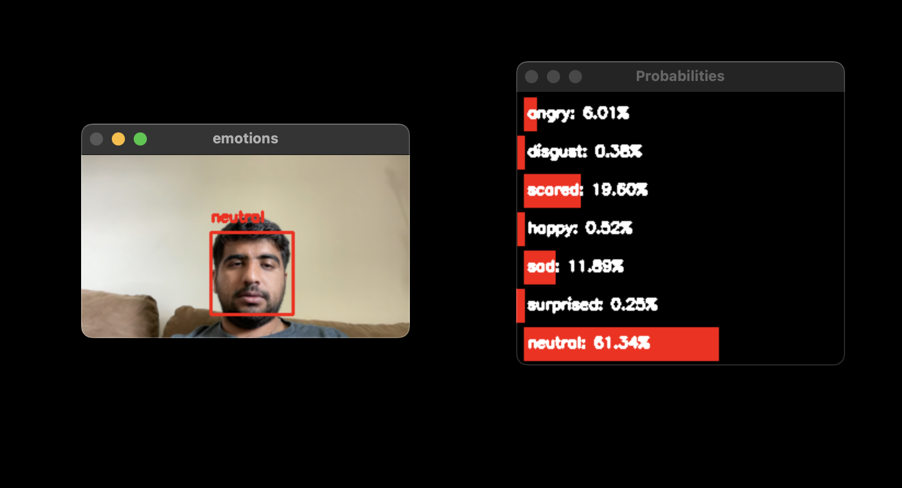

# Emotion Detection with CNN

This repository contains a project for detecting emotions from facial expressions using a Convolutional Neural Network (CNN) implemented with Keras and OpenCV.

## Overview

This project uses a pre-trained model to recognize emotions such as angry, disgust, scared, happy, sad, surprised, and neutral from real-time video input. The model is based on the VGGNet architecture and was trained on a dataset of facial expressions.

## Files

- `emotion_detector.py`: Main script for detecting emotions from video input.
- `emotionvggnet.py`: Defines the VGGNet model architecture for emotion detection.
- `hdf5datasetgenerator.py`: Script to handle HDF5 dataset generation.
- `haarcascade_frontalface_default.xml`: XML file containing Haar Cascade classifier for face detection.
- `train_recognizer.py`: Script to train the emotion detection model.
- `config.py`: Configuration file containing dataset paths and parameters.

## Setup

### Prerequisites

- Python 3.10 or later
- TensorFlow
- Keras
- OpenCV
- NumPy
- Imutils
- HDF5

### Installation

1. Clone the repository:
   ```bash
   git clone https://github.com/yourusername/emotion-detection.git
   cd emotion-detection

### Running the Code

python emotion_detector.py

### Training the Model

python train_recognizer.py --checkpoints path/to/checkpoints --model path/to/model --start_epoch 0

### Expected Output

The output will display the webcam feed with a bounding box around detected faces and the predicted emotion. A separate window will show the probabilities for each emotion.








   
